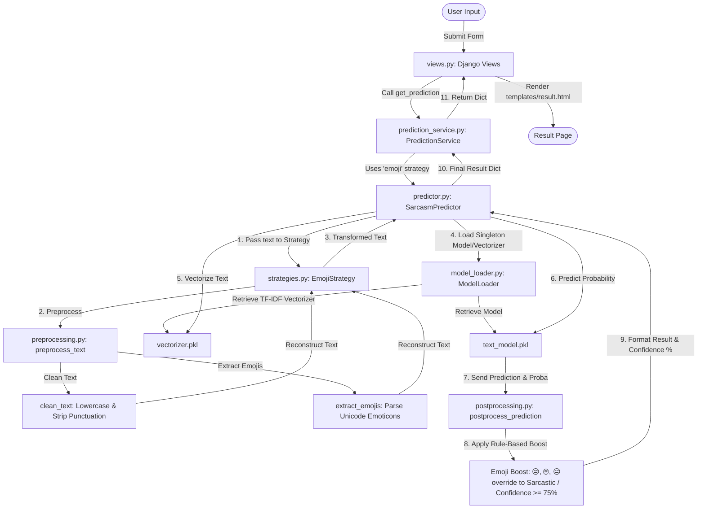

# Sarcasm Detection System

A Django-based machine learning web application that detects sarcasm in text inputs. The application processes user text, utilizes a TF-IDF vectorizer and a Logistic Regression classifier, applies custom emoji preprocessing/postprocessing strategies, and features a rule-based boost for highly-correlated sarcastic emojis.

---

## Architecture & Complete Data Flow



---

## Low-Level Component Explanation

The project is structured logically separating the web layer, the service layer, and the core machine learning pipeline (`ml/`).

### 1. Web Layer & Services
* **[views.py](file:///d:/Temps/opensource/sarcasm-detection-project/sarcasm-detection-project/sarcasm_detection_project/sarcasm_app/views.py)**: Handles routing. The `home` view renders the main interface, and the `result` view processes POST requests by invoking the `PredictionService` and rendering `result.html` with prediction labels and confidence scores.
* **[prediction_service.py](file:///d:/Temps/opensource/sarcasm-detection-project/sarcasm-detection-project/sarcasm_detection_project/sarcasm_app/services/prediction_service.py)**: Integrates the ML system into the application. It instantiates the predictor using the **Emoji Strategy** to ensure emojis in user text are preserved and processed.

### 2. Preprocessing & Design Patterns
* **[preprocessing.py](file:///d:/Temps/opensource/sarcasm-detection-project/sarcasm-detection-project/sarcasm_detection_project/sarcasm_app/ml/preprocessing.py)**: Contains core utility functions:
  * `clean_text(text)`: Lowercases text and strips non-word characters/punctuation.
  * `extract_emojis(text)`: Employs a unicode regex compile pattern to search and extract emoticons.
* **[strategies.py](file:///d:/Temps/opensource/sarcasm-detection-project/sarcasm-detection-project/sarcasm_detection_project/sarcasm_app/ml/strategies.py)**: Implements the **Strategy Pattern**. Defines a base class `PreprocessingStrategy` and two implementations:
  * `TextOnlyStrategy`: Uses cleaned text exclusively.
  * `EmojiStrategy`: Combines cleaned text with space-separated emojis to boost model features.
* **[model_factory.py](file:///d:/Temps/opensource/sarcasm-detection-project/sarcasm-detection-project/sarcasm_detection_project/sarcasm_app/ml/model_factory.py)**: Implements a simple factory method `get_strategy(strategy_type)` to resolve the active strategy context dynamically.

### 3. Model Loading & Inference
* **[model_loader.py](file:///d:/Temps/opensource/sarcasm-detection-project/sarcasm-detection-project/sarcasm_detection_project/sarcasm_app/ml/model_loader.py)**: Utilizes the **Singleton Pattern** via `__new__` to load the Logistic Regression model (`text_model.pkl`) and TF-IDF vectorizer (`vectorizer.pkl`) once. Subsequent imports reuse the same memory instance, optimizing server resource consumption.
* **[predictor.py](file:///d:/Temps/opensource/sarcasm-detection-project/sarcasm-detection-project/sarcasm_detection_project/sarcasm_app/ml/predictor.py)**: Orchestrates the pipeline by calling the strategy preprocessor, transforming inputs with the vectorizer, generating prediction probabilities, and delegating the output to post-processing.
* **[postprocessing.py](file:///d:/Temps/opensource/sarcasm-detection-project/sarcasm-detection-project/sarcasm_detection_project/sarcasm_app/ml/postprocessing.py)**: Applies a final post-classification adjustment.
  * **Rule-Based Boost**: If highly sarcasm-associated emojis (`😒`, `🙄`, `😑`) exist in the original text, the classification output is set to `"Sarcastic"` and the confidence score is boosted to a minimum of `75%`.
  * **Formatting**: Rescales raw probability scores to a percentage format rounded to two decimal places.

### 4. Training Utilities
* **[train_model.py](file:///d:/Temps/opensource/sarcasm-detection-project/sarcasm-detection-project/sarcasm_detection_project/sarcasm_app/ml/train_model.py)**: Loads sarcasm headlines dataset, trains a Logistic Regression classifier on TF-IDF features, and pickles the artifacts for runtime inference.
* **[fix_dataset.py](file:///d:/Temps/opensource/sarcasm-detection-project/sarcasm-detection-project/sarcasm_detection_project/fix_dataset.py)**: Sanity check utility to clean the raw JSON input dataset.

---

## Installation & Setup

1. **Activate the Virtual Environment**:
   ```powershell
   .venv\Scripts\activate
   ```

2. **Verify/Run Django Server Check**:
   ```powershell
   python manage.py check
   ```

3. **Run Django Local Development Server**:
   ```powershell
   python manage.py runserver
   ```
